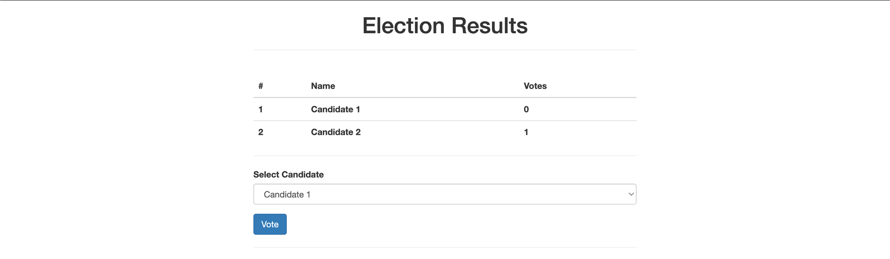

# e-Voting Project with Blockchain

This project is an implementation of an online voting application using Ethereum Blockchain technology. The development of this application was carried out as part of a Practical Work in November 2023.

## Objective

The aim of this project was to create a transparent, secure, and decentralized voting system by leveraging the features offered by Blockchain technology. We used tools such as Truffle, Ganache, and MetaMask to set up our development environment and deploy our smart contract.

## Installation Instructions

1. **Prerequisites**

   - Node.js and NPM : [https://nodejs.org](https://nodejs.org)
   - Truffle Framework : [https://www.trufflesuite.com](https://www.trufflesuite.com)
   - Ganache : [http://truffleframework.com/ganache/](http://truffleframework.com/ganache/)
   - MetaMask Ethereum Wallet : [https://metamask.io/](https://metamask.io/)

2. **Cloning the Repository**

```bash
   git clone https://github.com/fatma-laribi/TP-e-voting-blockchain.git
```

3. **Installing Dependencies**

```bash

    cd e-voting-blockchain
    npm install
```

4. **Configuring Ganache**
   Launch Ganache and configure it to use the same port as specified in the project.
5. **Deploying the Smart Contract**

```bash
    truffle migrate
```

6. **Starting the Application**

```bash
    npm run dev
```

7. **Importing Account into MetaMask**
   Copy the private key of a Ganache account.
   Import the account into MetaMask on the configured network.

## Test de l'Application

    1.  Access the application via http://localhost:3000
    2. Log in with MetaMask.
    3. Vote for a candidate.
    4. Confirm the transaction in MetaMask.

## Project Structure

- **contracts/** : Contains the smart contracts Election.sol and Migration.sol.
- **migrations/** : Migration files to deploy the contracts.
- **test/** : Test files for the contracts.
- **src/** : Contains the source code for the user interface.

## Conclusion

This project provided practical experience in developing a decentralized voting application. Feel free to explore the source code and contribute to its improvement!



